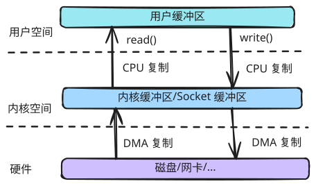

# IO 基础

## 概念

- 操作系统：管理计算机硬件与软件资源的系统软件，是**用户**与计算机硬件交互的接口（如 Ubuntu、RedHat 等）。
- 内核：操作系统的核心组件，负责管理计算机硬件与软件的运行，是**应用程序**与硬件交互的接口（如 Linux）。
- 内核空间：**内核**运行的**专用**内存区域，它与供普通应用程序运行的用户空间相隔离，但可以访问整个系统资源，包括用户空间。
- 用户空间：当前普通应用程序运行的内存区域，当前普通应用程序崩溃时，不会影响内核空间。
- 内核态：内核空间运行时，CPU 的运行模式，可以执行任何指令（如文件操作 open/read/write 等）。切换内核态有一定的性能开销。
- 用户态：用户空间运行时，CPU 的运行模式，许多特权指令被限制（如 IO 操作等）。切换用户态有一定的性能开销。
- DMA：Direct Memory Access，直接内存访问，是一种 CPU 与内存之间高速数据传输方式，可以省去 CPU 的全程调度。



## 概览

||基于字节输入|基于字节输出|基于字符输入|基于字符输出|
|---|---|---|---|---|
|基础|InputStream|OutputStream|Reader|Writer|
|数组|ByteArrayInputStream|ByteArrayOutputStream|CharArrayReader|CharArrayWriter|
|文件|FileInputStream|FileOutputStream|FileReader|FileWriter|
|管道|PipedInputStream|PipedOutputStream|PipedReader|PipedWriter|
|缓冲|BufferedInputStream|BufferedOutputStream|BufferedReader|BufferedWriter|
|过滤|FilterInputStream|FilterOutputStream|FilterReader|FilterWriter|
|字符串|||StringReader|StringWriter|
|数据|DataInputStream|DataOutputStream|||
|打印||PrintStream||PrintWriter|
|对象|ObjectInputStream|ObjectOutputStream|||
|转换|||InputStreamReader|OutputStreamWriter|

## 数组

### ByteArrayInputStream

```java
OutputStream os = // data 传输的目的输出流
byte[] data = // 数据源获取的 byte 数组数据
// 转为 ByteArrayInputStream 类型处理
InputStream is = new ByteArrayInputStream(data);
is.transferTo(os);
```

### ByteArrayOutputStream

```java
var os = new ByteArrayOutputStream();
os.write("Hello world".getBytes(StandardCharsets.UTF_8));
byte[] ba = os.toByteArray();
// ba: [72, 101, 108, 108, 111, 32, 119, 111, 114, 108, 100]
```

### CharArrayReader

```java
char[] data = "123456789".toCharArray();
CharArrayReader car = new CharArrayReader(data);
char[] target = "hello".toCharArray();
car.read(target);
// target: ['1', '2', '3', '4', '5']
```

### CharArrayWriter

```java
CharArrayWriter caw = new CharArrayWriter();
caw.write("Hello ");
caw.write("world");
char[] ca = caw.toCharArray();
// ca: ['H', 'e', 'l', 'l', 'o', ' ', 'w', 'o', 'r', 'l', 'd']
```

## 目录文件

```java
// `C:\development\project\java\misc>java Main`
Path root = Paths.get("/");
// root: C:\

Path dir = Paths.get("");
// dir: C:\development\project\java\misc

Path testFile = dir.resolve("test.txt");
// testFile: C:\development\project\java\misc\test.txt
try (BufferedWriter writer = Files.newBufferedWriter(testFile)) {
    writer.write("Hello world");
}
String content = Files.readString(testFile);
// content: "Hello world"
```
