# AQS

## AbstractQueuedSynchronizer

AQS 是 `AbstractQueuedSynchronizer` 的缩写，翻译过来就是抽象队列同步器。

AQS 是 Java 并发包 `java.util.concurrent` 的基石，提供了一个框架，用于实现阻塞锁和相关的同步器（信号量、事件等），这些同步器依赖于先进先出 (FIFO) 等待队列。此类旨在为大多数**依赖单个原子整数值来表示状态的同步器提供有用的基础**。子类必须定义用于更改此状态的受保护方法，以及定义该状态在对象被获取或释放时的含义。有了这些定义，此类中的其他方法将执行所有排队和阻塞机制。子类可以维护其他状态字段，但只有使用 `getState`、`setState` 和 `compareAndSetState` 方法操作的原子更新的整数值才会被跟踪以进行同步。

子类应定义为非公开的内部辅助类，用于实现其父类的同步属性。类 `AbstractQueuedSynchronizer` 并未实现任何同步接口。相反，它定义了诸如 `acquireInterruptibly` 之类的方法，这些方法可由具体的锁和相关的同步器根据需要调用，以实现它们的公共方法。

此类支持默认的**独占模式**/**共享模式**。在独占模式下获取锁时，其他线程的获取尝试将无法成功。多个线程在共享模式下的获取尝试可能（但不一定）成功。此类并不 "理解" 这些模式之间的区别，只是在机制层面上，当共享模式获取成功时，下一个等待的线程（如果存在）也必须判断自己是否可以获取锁。处于不同模式的等待线程共享同一个 FIFO 队列。通常，实现子类只支持其中一种模式，但两种模式都可以同时使用，例如在 `ReadWriteLock` 中仅支持独占模式或仅支持共享模式的子类无需定义支持未使用模式的方法。

核心字段：

```java
public abstract class AbstractQueuedSynchronizer
    extends AbstractOwnableSynchronizer
    implements java.io.Serializable {

    private transient volatile Node head;
    private transient volatile Node tail;
    private volatile int state;

    /**
     * 记录当前以独占模式持有同步器（即锁）的线程，继承 AbstractOwnableSynchronizer
     */
    private transient Thread exclusiveOwnerThread;
}
```

- `head`: 头节点
  1. 标识当前持有资源的线程，`head.waiter == null`
  2. 作为 CLH 同步队列的管理入口
  3. 触发后继节点的获取与唤醒

- `tail`: 尾节点
  1. 标识当前没有资源的线程，`tail.waiter != null`。
    - 注意：若是第一次，则与 head 一同初始化且指向一个不包含线程的虚拟节点，`head == tail`
  2. 管理新节点 CAS 入队
  3. 支持从后向前遍历

- `state`: 资源状态，不同场景具有不同的含义
  - `ReentrantLock`: 锁的持有计数。0 表示锁未被任何线程占用；>=1 表示锁被占用，其数值代表持有线程的重入次数。
  - `ReentrantReadWriteLock`: 高16位表示读锁持有数，低16位表示写锁持有数。通过一个变量同时管理读、写两种状态。
  - `Semaphore`: 当前可用的许可证数量。线程获取许可证时 `state` 减少，释放时增加。
  - `CountDownLatch`: 计数器的当前值。初始化后，每次有线程调用 `countDown()`，`state` 减 1，直至为 0 时唤醒所有等待线程。

```java
void sleep(long seconds) {
    try {
        TimeUnit.SECONDS.sleep(seconds);
    } catch (InterruptedException e) {
        throw new RuntimeException(e);
    }
}

void main() {
    // 单线程
    ReentrantLock lock = new ReentrantLock();
    lock.lock();
    lock.unlock();

    // 多线程
    Thread lockedThread = new Thread(() -> {
        lock.lock();
        sleep(3L); // 确保竞争
        lock.unlock();
    });
    lockedThread.setName("lockedThread");
    lockedThread.start();
    sleep(1L); // 确保其他线程上锁

    lock.lock();
    lock.unlock();
}
```

### 单线程加锁解锁

执行 `ReentrantLock lock = new ReentrantLock();`

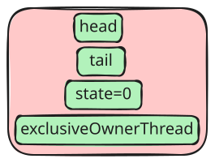

执行 `lock.lock();`，主要执行逻辑在 [java.util.concurrent.locks.ReentrantLock.NonfairSync.initialTryLock()](https://github.com/openjdk/jdk/blob/jdk-25%2B0/src/java.base/share/classes/java/util/concurrent/locks/ReentrantLock.java#L225-L229)

```java
Thread current = Thread.currentThread();
if (compareAndSetState(0, 1)) { // first attempt is unguarded
    setExclusiveOwnerThread(current);
    return true;
} // ...
```

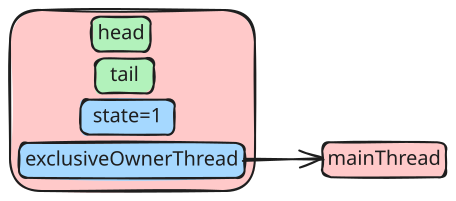

执行 `lock.unlock();`，主要逻辑在 [java.util.concurrent.locks.ReentrantLock.Sync.tryRelease(1)](https://github.com/openjdk/jdk/blob/jdk-25%2B0/src/java.base/share/classes/java/util/concurrent/locks/ReentrantLock.java#L173-L182)

```java
int c = getState() - releases;
if (getExclusiveOwnerThread() != Thread.currentThread())
    // 判断是否由加锁线程解锁
    throw new IllegalMonitorStateException();
boolean free = (c == 0);
if (free)
    setExclusiveOwnerThread(null);
```

解锁后状态将恢复到 `new` 的状态


可见，在单线程加解锁主要是 CAS 的消耗。

### 多线程加锁解锁

`lockedThread` 线程先获取锁加锁 `lock.lock();`，此时的状态为

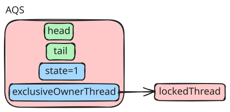

---

这个时候 `mainThread` 再去获取锁加锁 `lock.lock();` 时，主要逻辑在 [java.util.concurrent.locks.AbstractQueuedSynchronizer.acquire(null, arg, false, false, false, 0L)](https://github.com/openjdk/jdk/blob/jdk-25%2B0/src/java.base/share/classes/java/util/concurrent/locks/AbstractQueuedSynchronizer.java#L704-L804)

第一次循环，执行 `tryInitializeHead()`

```java
Node h = // ...

if (U.compareAndSetReference(this, HEAD, null, h))
    return tail = h;
```

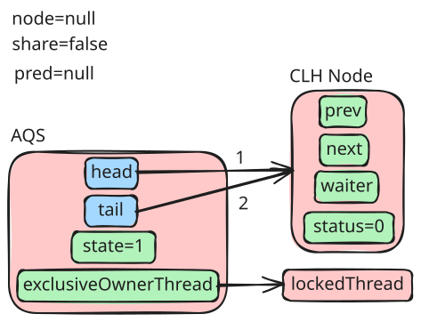

第二次循环，执行 `node = (shared) ? new SharedNode() : new ExclusiveNode();`

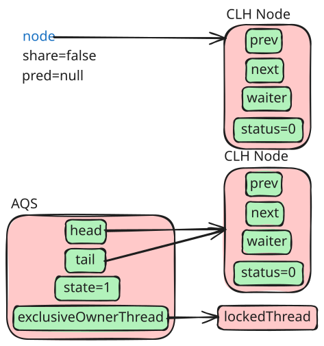

第三次循环，

```java
Node pred = null;               // predecessor of node when enqueued
// ...

Node t;
if ((t = tail) == null) {           // initialize queue
    // ...
} else if (pred == null) {          // try to enqueue
    node.waiter = current;
    node.setPrevRelaxed(t);         // avoid unnecessary fence
    if (!casTail(t, node))
        node.setPrevRelaxed(null);  // back out
    else
        t.next = node;
}
```

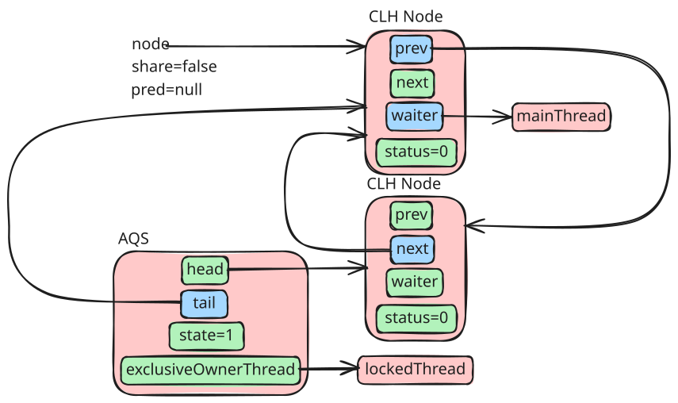

第四次循环，

```java
Node node
// ...
Node pred = null;               // predecessor of node when enqueued
// ...

if (!first && (pred = (node == null) ? null : node.prev) != null &&
        !(first = (head == pred))) {
} else if (node.status == 0) {
    node.status = WAITING;          // enable signal and recheck
}
```

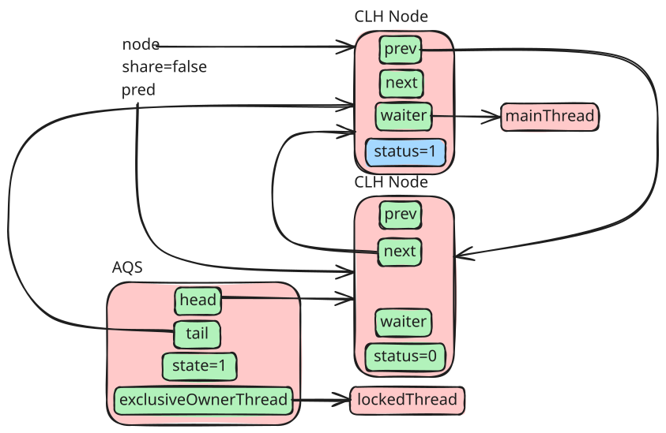

第五次循环，

```java
if (!first && (pred = (node == null) ? null : node.prev) != null &&
        !(first = (head == pred))) {
    // ...
} else {
    // ...
    if (!timed)
        LockSupport.park(this);
    // ...
}
```

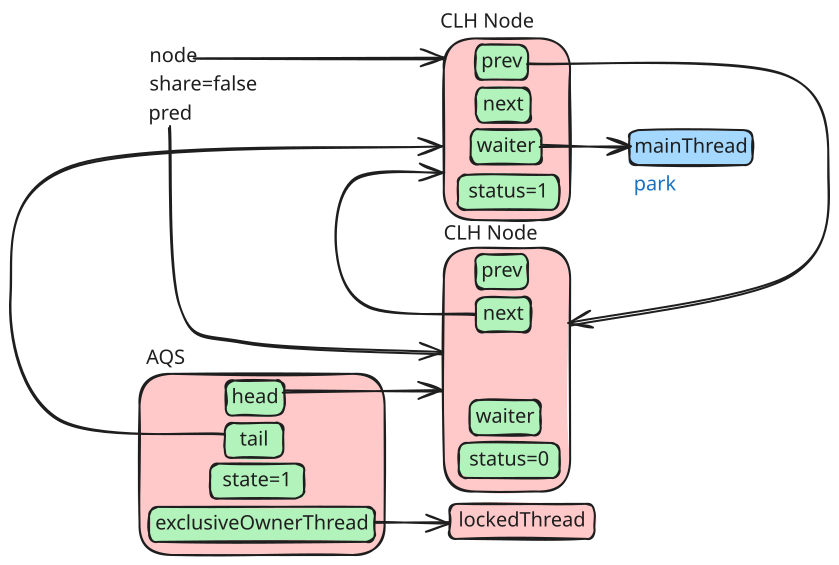

至此，`mainThread` 线程进入 CLH 队列并 `LockSupport.park(Object)` 等待唤醒。

---

`lockedThread` 解锁时也很简单，执行 `lock.unlock();`，主要逻辑在 [java.util.concurrent.locks.AbstractQueuedSynchronizer.release(1)](https://github.com/openjdk/jdk/blob/jdk-25+0/src/java.base/share/classes/java/util/concurrent/locks/AbstractQueuedSynchronizer.java#L1097-L1103)，然后唤醒 `mainThread`

```java
private static void signalNext(Node h) {
    Node s;
    if (h != null && (s = h.next) != null && s.status != 0) {
        s.getAndUnsetStatus(WAITING);
        LockSupport.unpark(s.waiter);
    }
}
```

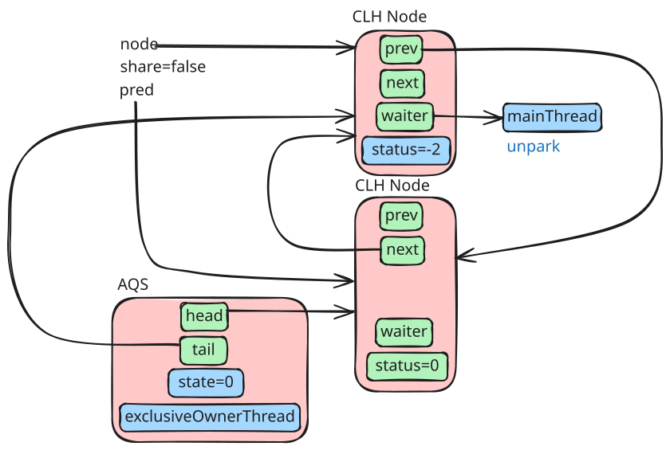

---

`mainThread` `unpark` 之后获取到 CPU 继续执行 `node.clearStatus();`

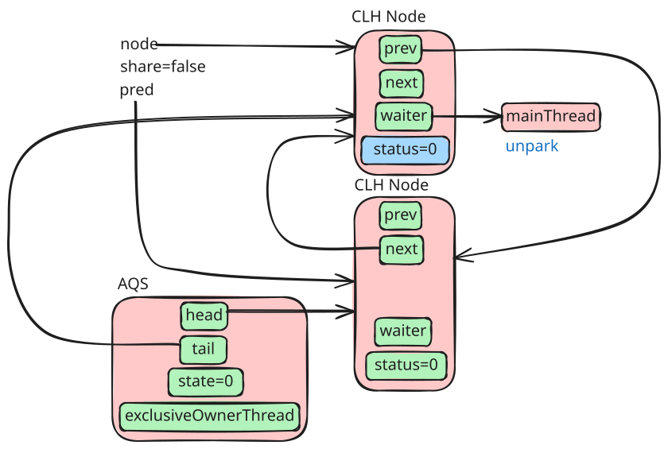

继续执行

```java
boolean acquired;

acquired = tryAcquire(arg); // true

if (acquired) {
    if (first) {
        node.prev = null;
        head = node;
        pred.next = null;
        node.waiter = null;
        if (shared)
            signalNextIfShared(node);
        if (interrupted)
            current.interrupt();
    }
    return 1;
}
```

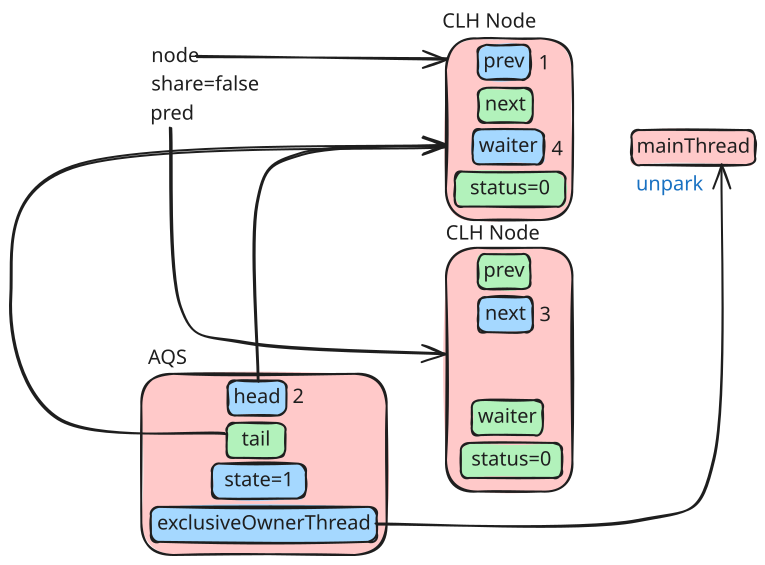

流程图清理下其它节点，则又变成单线程加锁状态了，只不过这个时候的 AQS 的 `head` 和 `tail` 不为空，指向了同一个 CLH 节点

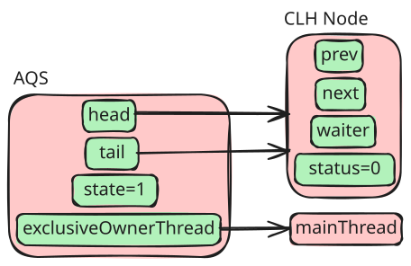
