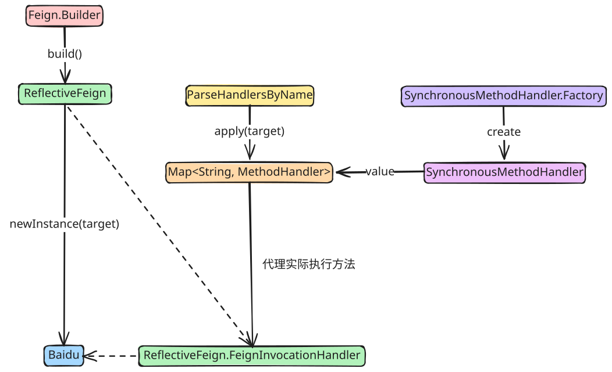
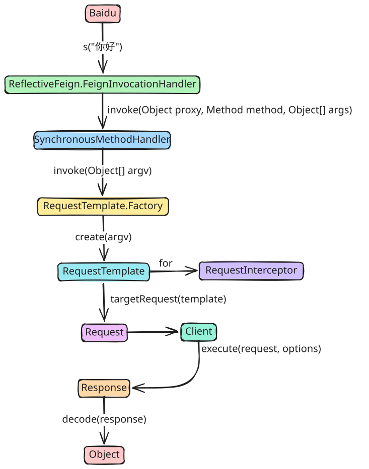

# Feign 基础

## 简介

> [Feign](https://github.com/OpenFeign/feign)

Feign 是一个声明式的 Java HTTP 客户端框架，由 Netflix 开源并成为 Spring Cloud 生态系统的核心组件。它的设计理念是让开发者能够像调用本地方法一样调用远程 HTTP 服务，极大地简化了微服务架构中的服务间通信。

Feign 通过注解和接口定义的方式，将复杂的 HTTP 请求细节封装起来，开发者只需关注业务逻辑的实现。它支持多种 HTTP 客户端实现（如 Apache HttpClient、OkHttp 等），并提供了丰富的扩展机制，可以与 Ribbon、Hystrix、Eureka 等 Spring Cloud 组件无缝集成。

## 示例

pom.xml

```xml
<dependency>
    <groupId>io.github.openfeign</groupId>
    <artifactId>feign-core</artifactId>
    <version>10.0.0</version>
    <scope>compile</scope>
</dependency>
```

Main.java

```java
import feign.Feign;
import feign.Param;
import feign.RequestLine;

interface Baidu {
    @RequestLine("GET /s?wd={keyword}")
    String s(@Param("keyword") String keyword);
}

void main() {
    Feign.Builder fb = Feign.builder();
    Baidu baidu = fb.target(Baidu.class, "https://www.baidu.com");

    String html = baidu.s("你好");
    IO.println(html);
}
```

## 核心特性

- 声明式接口调用：通过 Java 接口和注解定义 HTTP API，无需手动编写 HTTP 请求代码。
- 动态代理实现：基于 JDK 动态代理自动生成接口实现类。
- 模板化请求：使用 URI 模板（[RFC 6570](https://www.rfc-editor.org/rfc/rfc6570)）定义请求路径和参数。
- 可插拔编解码器：支持 JSON、XML 等多种数据格式的序列化和反序列化。
- 负载均衡集成：与 Ribbon/Spring Cloud LoadBalancer 集成实现客户端负载均衡。
- 容错机制：支持 Hystrix、Sentinel 等熔断降级框架。

## 核心流程

### 创建代理

执行

```java
Feign.Builder fb = Feign.builder();
```

创建一个默认配置的 `Feign.Builder` 对象

```java
public static class Feign.Builder {
    /**
     * 请求拦截器
     * 在执行请求操作前，会调用拦截器的 apply 方法
     */
    private final List<RequestInterceptor> requestInterceptors =
        new ArrayList<RequestInterceptor>();
    /**
     * 日志级别
     */
    private Logger.Level logLevel = Logger.Level.NONE;
    /**
     * 契约
     * 若需要自定义契约，则需要实现 Contract 接口
     * 如 SpringMvcContract 将 Spring MVC 注解（如 @RequestMapping、@RequestParam 等）解析为 Feign 内部的 MethodMetadata 对象
     */
    private Contract contract = new Contract.Default();
    /**
     * 请求客户端
     * 默认使用 JDK 的 HttpURLConnection 实现，不推荐使用
     */
    private Client client = new Client.Default(null, null);
    /**
     * 重试机制
     * 默认重试 5 次
     */
    private Retryer retryer = new Retryer.Default();
    /**
     * 日志记录器
     * 默认不记录日志
     */
    private Logger logger = new NoOpLogger();
    /**
     * 编解码器
     * 默认只支持字符串和 byte[] 的编解码
     */
    private Encoder encoder = new Encoder.Default();
    /**
     * 解码器
     * 默认只支持字符串和 byte[] 的编解码
     */
    private Decoder decoder = new Decoder.Default();
    /**
     * 查询参数编码器
     * 默认根据反射 Field 对象映射
     */
    private QueryMapEncoder queryMapEncoder = new QueryMapEncoder.Default();
    /**
     * 错误解码器
     * 默认解码 HTTP 状态码非 [200, 300) 和非 404 的响应
     */
    private ErrorDecoder errorDecoder = new ErrorDecoder.Default();
    /**
     * 请求选项
     * 默认连接时间 10s
     * 默认读取时间 60s
     * 默认开启重定向
     */
    private Options options = new Options();
    /**
     * 调用处理器工厂
     * 默认使用 ReflectiveFeign.FeignInvocationHandler 实现
     * 用于创建代理对象
     * 对应的 invoke 方法将调用请求
     */
    private InvocationHandlerFactory invocationHandlerFactory =
        new InvocationHandlerFactory.Default();
    /**
     * 是否解码 404 响应
     * 默认不解码
     */
    private boolean decode404;
    /**
     * 解码后是否关闭连接
     * 默认关闭
     */
    private boolean closeAfterDecode = true;
}
```

执行

```java
Baidu baidu = fb.target(Baidu.class, "https://www.baidu.com");
```

创建一个 `Baidu` 接口的代理对象，并指定目标地址为 `https://www.baidu.com`



### 发送请求

执行

```java
String html = baidu.s("你好");
```


