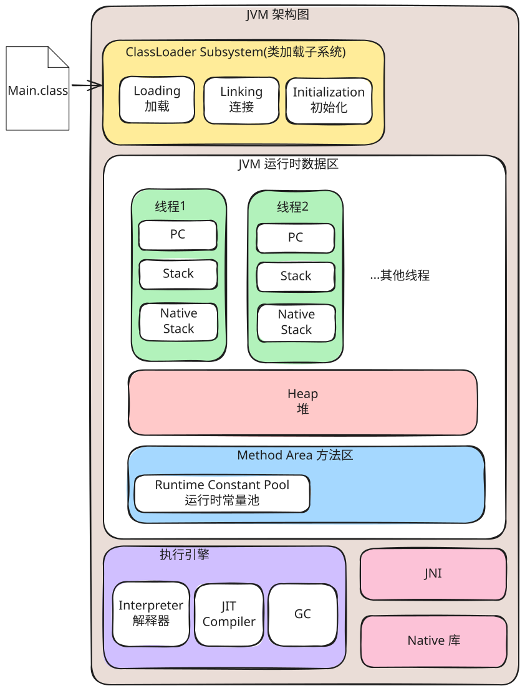

# JVM 基础

## 规范

- [Java Language and Virtual Machine Specifications](https://docs.oracle.com/javase/specs/index.html)

## 内存架构



总内存 ≈ 堆内存 + 直接内存 + 元空间 + 线程栈 + JIT 代码缓存 + GC 开销 + JVM 自身内存<br>

- **堆内存**

存放所有对象实例和数组。

- **直接内存**

对外内存，通过 NIO 的 `ByteBuffer#allocateDirect` 方法分配。

控制参数：`-XX:MaxDirectMemorySize`

> 直接内存无法分配内存的日志是怎样的？<br>

Main.java

```java
import java.nio.ByteBuffer;
import java.util.ArrayList;

void main() {
    var buffers = new ArrayList<>();
    while (true) {
        // 1 G
        var buffer = ByteBuffer.allocateDirect(1024 * 1024 * 1024);
        buffer.put((byte) 1);
        buffers.add(buffer);
    }
}
```

执行命令：

```sh
# jdk 25
java -Xlog:gc* Main.java
```

那么日志则为

```log
...
Exception in thread "main" java.lang.OutOfMemoryError: Cannot reserve 1073741824 bytes of direct buffer memory (allocated: 3221225472, limit: 4120903680)
        at java.base/java.nio.Bits.reserveMemory(Bits.java:178)
        at java.base/java.nio.DirectByteBuffer.<init>(DirectByteBuffer.java:108)
        at java.base/java.nio.ByteBuffer.allocateDirect(ByteBuffer.java:367)
        at Main.main(Main.java:7)
...
```

- **元空间**

存放类的元数据，如类名、字节码等。

控制参数：`-XX:MaxMetaspaceSize`

> 元空间内存不够的日志是怎样的？<br>

Main.java

```java
void main() {
    IO.print("Hello world");
}
```

执行命令：

```sh
# jdk 25
java -XX:MaxMetaspaceSize=1024K -XX:+HeapDumpOnOutOfMemoryError -XX:HeapDumpPath=./ -Xlog:gc* Main.java
```

那么将会得到

```log
...
[0.141s][info][gc,metaspace,freelist,oom]
java.lang.OutOfMemoryError: Metaspace
[0.141s][info][gc                       ] GC(6) Concurrent Mark Cycle 15.367ms
Dumping heap to ./\java_pid18000.hprof ...
Heap dump file created [4961080 bytes in 0.014 secs]
...
[0.181s][info][gc,metaspace,freelist,oom] Metaspace (data) allocation failed for size 8
[0.181s][info][gc,metaspace,freelist,oom]
[0.181s][info][gc,metaspace,freelist,oom] Usage:
[0.181s][info][gc,metaspace,freelist,oom]   Non-class:    890.41 KB used.
[0.181s][info][gc,metaspace,freelist,oom]       Class:     68.48 KB used.
[0.181s][info][gc,metaspace,freelist,oom]        Both:    958.89 KB used.
[0.181s][info][gc,metaspace,freelist,oom]
[0.181s][info][gc,metaspace,freelist,oom] Virtual space:
[0.181s][info][gc,metaspace,freelist,oom]   Non-class space:       64.00 MB reserved,     896.00 KB (  1%) committed,  1 nodes.
[0.181s][info][gc,metaspace,freelist,oom]       Class space:       16.00 MB reserved,     128.00 KB ( <1%) committed,  1 nodes.
[0.181s][info][gc,metaspace,freelist,oom]              Both:       80.00 MB reserved,       1.00 MB (  1%) committed.
[0.181s][info][gc,metaspace,freelist,oom]
[0.181s][info][gc,metaspace,freelist,oom] Chunk freelists:
[0.181s][info][gc,metaspace,freelist,oom]    Non-Class:  11.62 MB
[0.181s][info][gc,metaspace,freelist,oom]        Class:  15.70 MB
[0.181s][info][gc,metaspace,freelist,oom]         Both:  27.33 MB
[0.181s][info][gc,metaspace,freelist,oom]
[0.181s][info][gc,metaspace,freelist,oom] MaxMetaspaceSize: 1.00 MB
[0.181s][info][gc,metaspace,freelist,oom] CompressedClassSpaceSize: 16.00 MB
[0.181s][info][gc,metaspace,freelist,oom] Initial GC threshold: 1.00 MB
[0.181s][info][gc,metaspace,freelist,oom] Current GC threshold: 1.00 MB
...
java.lang.OutOfMemoryError: Metaspace
        at java.base/java.lang.ClassLoader.defineClass2(Native Method)
        at java.base/java.lang.ClassLoader.defineClass(ClassLoader.java:1052)
        at java.base/java.security.SecureClassLoader.defineClass(SecureClassLoader.java:176)
        at java.base/jdk.internal.loader.BuiltinClassLoader.defineClass(BuiltinClassLoader.java:735)
        at java.base/jdk.internal.loader.BuiltinClassLoader.findClassInModuleOrNull(BuiltinClassLoader.java:678)
        at java.base/jdk.internal.loader.BuiltinClassLoader.loadClassOrNull(BuiltinClassLoader.java:604)
        at java.base/jdk.internal.loader.BuiltinClassLoader.loadClass(BuiltinClassLoader.java:578)
        at java.base/java.lang.ClassLoader.loadClass(ClassLoader.java:490)
        at jdk.compiler/com.sun.tools.javac.file.BaseFileManager.<clinit>(BaseFileManager.java:268)
        at jdk.compiler/com.sun.tools.javac.api.JavacTool.getStandardFileManager(JavacTool.java:108)
        at jdk.compiler/com.sun.tools.javac.launcher.ProgramDescriptor.of(ProgramDescriptor.java:68)
        at jdk.compiler/com.sun.tools.javac.launcher.SourceLauncher.run(SourceLauncher.java:132)
        at jdk.compiler/com.sun.tools.javac.launcher.SourceLauncher.main(SourceLauncher.java:76)
[0.191s][info][gc,exit                  ] Heap
[0.191s][info][gc,exit                  ]  garbage-first heap   total reserved 4024320K, committed 8192K, used 1869K [0x000000070a600000, 0x0000000800000000)
[0.191s][info][gc,exit                  ]   region size 2048K, 1 young (2048K), 0 survivors (0K)
[0.191s][info][gc,exit                  ]  Metaspace       used 959K, committed 1024K, reserved 81920K
[0.191s][info][gc,exit                  ]   class space    used 68K, committed 128K, reserved 16384K
```

- **线程栈**

存放局部变量、方法调用信息等。

控制参数：`-Xss`

- **JIT 代码缓存**

存放热点代码，将字节码编译成本地机器码。

控制参数：`-XX:ReservedCodeCacheSize`

- **GC 开销**

垃圾收集器维护的数据结构。如 G1 的 Card Table、Remembered Set 等。

- **JVM 自身内存**

JVM 内部维护的数据结构，加载的 so/dll 库等。

## 内存模型

Java 内存模型（Java Memory Model, JMM）旨在解决由于硬件缓存、指令重排序等优化带来的三大问题：

1. 原子性：确保关键操作不被中断
2. 可见性：确保一个线程修改了共享变量后，其他线程能立即看到最新结果
3. 有序性：确保程序执行顺序符合预期

JMM 定义了一个抽象概念：每个**线程**有自己的**工作内存**（可以理解为线程私有的高速缓存或寄存器抽象），所有**共享变量**都在**主内存**（主要对应堆中的共享数据区域）。即定义了**多线程之间如何通过内存交互**。

### Happens-Before 原则

Happens-Before 原则是 JMM 的基石，它为解决并发编程中的**可见性**和**有序性**问题提供了一套关键规则：

1. 程序顺序规则：同一线程内，书写在前面的操作 Happens-Before 后续操作
2. 监视器锁规则​：对一个锁的解锁操作 Happens-Before 于后续对同一个锁的加锁操作
3. `volatile` 变量规则​：对一个 `volatile` 变量的写操作 Happens-Before 于后续对这个变量的读操作
4. 线程启动规则：线程的 `Thread#start` 方法调用 Happens-Before 于该线程中的任何操作
5. 线程终止规则​：线程中的所有操作都 Happens-Before 于其他线程成功从该线程的 `Thread#join` 方法返回
6. 线程中断规则：对线程 `Thread#interrupt` 方法的调用 Happens-Before 于被中断线程检测到中断事件
7. 对象终结规则​：一个对象的构造函数执行结束 Happens-Before 于该对象的 `Object#finalize` 方法的开始
8. 传递性规则：如果操作 A Happens-Before 于 B，操作 B Happens-Before 于 C，那么操作 A Happens-Before 于 C
