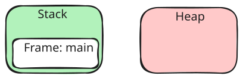
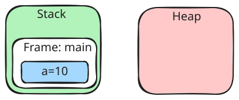
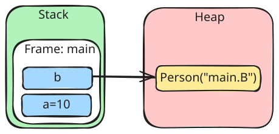
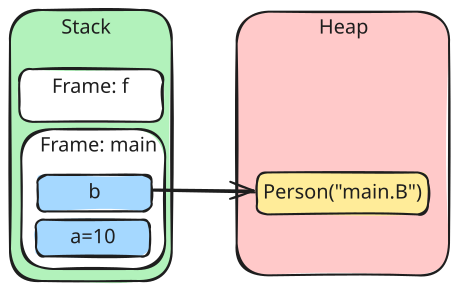
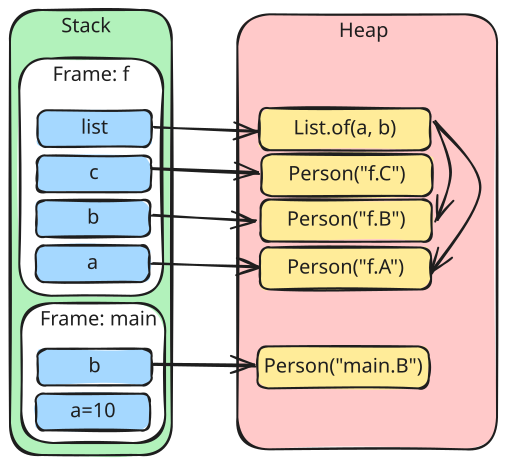
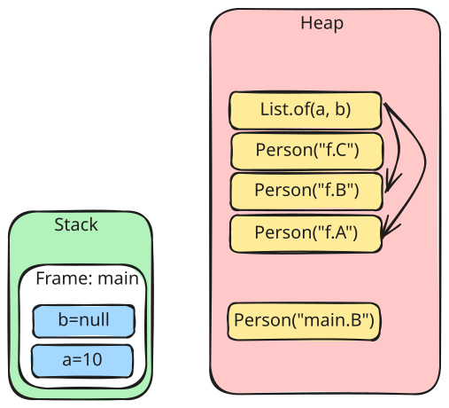
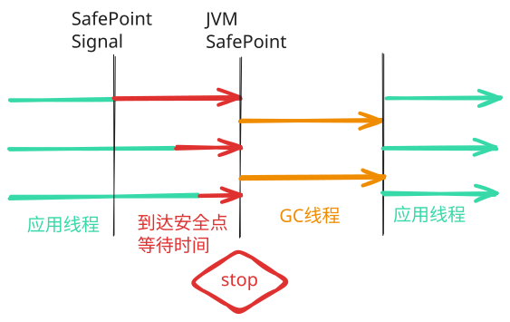

# GC 基础

## 内存结构


**Stack**: 栈帧, 线程私有, 随着方法调用创建, 随着方法返回销毁.

**Heap**: 堆, 线程共享, 需要垃圾回收(GC)管理. 存储对象实例、数组等动态分配的数据.

**Metaspace**: 元空间, 使用本地内存(非堆内存), 线程共享. 存储 JVM 加载的 `Class` 元信息、常量、JIT 编译的代码缓存等数据. 该区域支持选择性回收(如常量池回收、类卸载等).

```java
public class Main {

    record Person(String name) {
        @Override
        public String toString() {
            return name;
        }
    }

    public static void f() {
        var a = new Person("f.A"); // 堆对象
        var b = new Person("f.B"); // 堆对象
        var c = new Person("f.C"); // 堆对象

        var list = List.of(a, b);  // 堆对象
    }

    public static void main(String[] args) {
        var a = 10;                   // 栈对象（基本类型）
        var b = new Person("main.B"); // 堆对象

        f();                          // 调用方法

        b = null;                     // 断开引用对象
    }
}
```

JVM 有一套自己的自动管理内存的机制, 称之为**垃圾回收器**, 每次执行 `new` 字节码时会申请内存, 并将该内存设置为占用. 现在我们从上面 `main()` 方法开始执行, 创建栈帧



执行 `var a = 10;`



执行 `var b = new Person("main.B");`



执行 `f();`, 创建栈帧



执行 `f()` 完毕但还未返回



执行 `f()` 完毕后返回 `main()`


此时我们可以发现, 堆上有些数据不可访问了, 并且占用着内存, 继续执行 `b = null;`



代码逻辑全部执行完后, 堆上有很多无法访问的垃圾数据, 若该应用是个服务器应用或其他, 还需要执行其他方法, 堆始终会有用完的时候, 那么堆快满的时候, 垃圾收集器就要工作清理垃圾防止内存耗尽导致 `OutOfMemoryError`.

## 回收阶段

清理内存时, 并非一步到位的事情. 分为以下三个阶段:
1. 追踪(Tracing): 识别所有可达对象
2. 释放(Freeing): 释放不再使用的内存
3. 压缩(Compaction): 移动 heap 对象, 并重新定位活动对象

## Stopping The World

简称 STW, 是指在执行垃圾回收的过程中, 冻结所有应用线程的执行, 直到垃圾回收线程执行结束.

过程：



### SafePoint

安全点, 应用线程执行过程中的一些特殊位置. SafePoint 保存了应用线程的上下文.