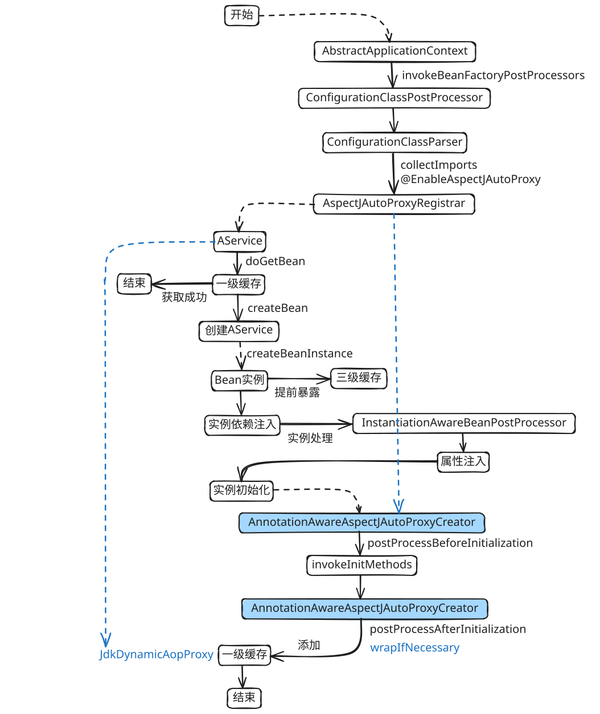

# Spring 基础

## IoC 容器

IoC容器（Inversion of Control Container）是​​实现**控制反转设计原则**的核心框架工具。依赖注入（Dependency Injection，DI）是一种​​解耦组件依赖关系​​的设计模式，通过将对象的创建、依赖管理和生命周期控制权从应用程序代码转移到外部容器，而非在对象内部硬编码实现，实现组件间的解耦。它是控制反转（IoC）的核心实现方式。

```xml
<dependency>
    <groupId>org.springframework</groupId>
    <artifactId>spring-context</artifactId>
    <version>3.2.18.RELEASE</version>
</dependency>
```

```java
public interface IService {
    void print();
}
public static class AService implements IService {
    @Override
    public void print() {
        System.out.println("AService");
    }
}

public static void main(String[] args) {
    var ctx = new AnnotationConfigApplicationContext();
    // 1. 注册 BeanDefinition
    ctx.register(AService.class);

    // 2. 初始化并实例化单例 Bean
    ctx.refresh();

    // 3. 获取 Bean
    AService a = ctx.getBean(AService.class);
    a.print();
    // AService
}
```

获取 `AService` Bean 流程


```java
AbstractBeanFactory
    #doGetBean(final String name, final Class<T> requiredType, final Object[] args, boolean typeCheckOnly)
    // 尝试从一级缓存获取，若有，则返回
    #getSingleton(String beanName)
    // 先实例依赖的 Bean
    RootBeanDefinition
        #getDependsOn()
    #getSingleton(String beanName, ObjectFactory<?> singletonFactory)
        ObjectFactory
            #getObject()
            AbstractAutowireCapableBeanFactory
                #createBean(String beanName, RootBeanDefinition mbd, Object[] args)
                #resolveBeforeInstantiation(String beanName, RootBeanDefinition mbd)
                #doCreateBean(final String beanName, final RootBeanDefinition mbd, final Object[] args)
                    // 根据反射获取构造器实例化
                    BeanWrapper
                        #getWrappedInstance()
                    // 提前暴露给三级缓存
                    #addSingletonFactory(String beanName, ObjectFactory singletonFactory)
                    // 依赖注入
                    #populateBean(String beanName, RootBeanDefinition mbd, BeanWrapper bw)
                        // 实例化后处理
                        InstantiationAwareBeanPostProcessor
                            #postProcessAfterInstantiation(Object bean, String beanName)
                    // 初始化
                    #initializeBean(final String beanName, final Object bean, RootBeanDefinition mbd)
```

上面是获取一个自定义 Bean 的流程，循环依赖 Bean 的获取流程

```java
public interface IService {
    void print();
}
public static class AService implements IService {
    @Autowired
    private BService bService;
    @Override
    public void print() {
        System.out.println("AService");
        bService.print();
    }
}
public static class BService implements IService {
    @Autowired
    private AService aService;
    @Override
    public void print() {
        System.out.println("BService");
    }
}

public static void main(String[] args) {
    var ctx = new AnnotationConfigApplicationContext();
    // 1. 注册
    ctx.register(AService.class);
    ctx.register(BService.class);

    // 2. 初始化并实例化单例 Bean
    ctx.refresh();

    // 3. 获取 Bean
    AService a = ctx.getBean(AService.class);
    a.print();
    // AService
    // BService
}
```

循环依赖流程


## AOP

```xml
<dependency>
    <groupId>org.aspectj</groupId>
    <artifactId>aspectjweaver</artifactId>
    <version>1.9.22</version>
</dependency>
```

```java
package io.github.xianzhan.spring.aop;

import java.lang.annotation.ElementType;
import java.lang.annotation.Retention;
import java.lang.annotation.RetentionPolicy;
import java.lang.annotation.Target;

@Target(ElementType.METHOD)
@Retention(RetentionPolicy.RUNTIME)
public @interface LogAnnotation {
}
```

```java
public class Main {
    public interface IService {
        void print();
    }

    @Service
    public static class AService implements IService {
        @LogAnnotation
        @Override
        public void print() {
            System.out.println("AService");
        }
    }

    @EnableAspectJAutoProxy
    @Aspect
    @Component
    public static class LogAspect {
        @Pointcut("@annotation(io.github.xianzhan.spring.aop.LogAnnotation)")
        public void pointCut() {

        }
        @Around("pointCut()")
        public Object around(ProceedingJoinPoint jp) throws Throwable {
            System.out.println("LogAspect#around before");
            Object[] args = jp.getArgs();
            Object proceed = jp.proceed(args);
            System.out.println("LogAspect#around proceed");
            return proceed;
        }
    }

    public static void main(String[] args) {
        AnnotationConfigApplicationContext ctx = new AnnotationConfigApplicationContext();

        ctx.register(LogAspect.class);
        ctx.register(AService.class);

        ctx.refresh();

        IService a = ctx.getBean(IService.class);
        a.print();
        // LogAspect#around before
        // AService
        // LogAspect#around proceed
    }
}
```

AOP 流程


