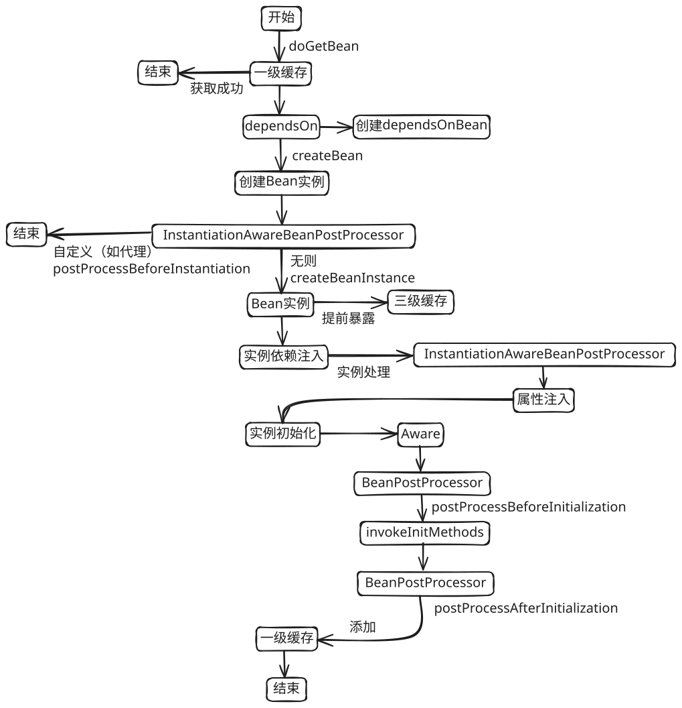
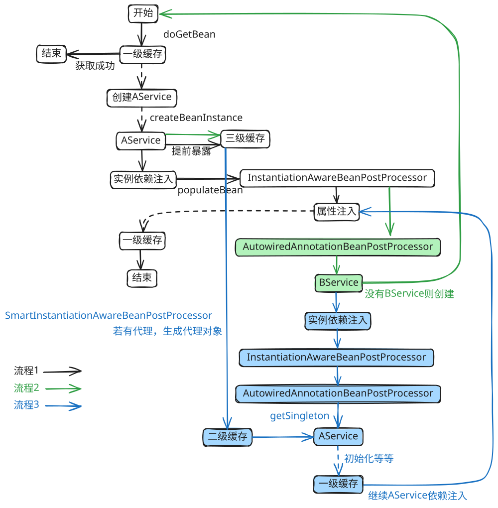

# Spring 基础

## IoC 容器

IoC容器（Inversion of Control Container）是​​实现**控制反转设计原则**的核心框架工具。依赖注入（Dependency Injection，DI）是一种​​解耦组件依赖关系​​的设计模式，通过将对象的创建、依赖管理和生命周期控制权从应用程序代码转移到外部容器，而非在对象内部硬编码实现，实现组件间的解耦。它是控制反转（IoC）的核心实现方式。

```java
public interface IService {
    void print();
}
public static class AService implements IService {
    @Override
    public void print() {
        System.out.println("AService");
    }
}

public static void main(String[] args) {
    var ctx = new AnnotationConfigApplicationContext();
    // 1. 注册 BeanDefinition
    ctx.register(AService.class);

    // 2. 初始化并实例化单例 Bean
    ctx.refresh();

    // 3. 获取 Bean
    AService a = ctx.getBean(AService.class);
    a.print();
    // AService
}
```

获取 `AService` Bean 流程



上面是获取一个自定义 Bean 的流程，循环依赖 Bean 的获取流程

```java
public interface IService {
    void print();
}
public static class AService implements IService {
    @Autowired
    private BService bService;
    @Override
    public void print() {
        System.out.println("AService");
        bService.print();
    }
}
public static class BService implements IService {
    @Autowired
    private AService aService;
    @Override
    public void print() {
        System.out.println("BService");
    }
}

public static void main(String[] args) {
    var ctx = new AnnotationConfigApplicationContext();
    // 1. 注册
    ctx.register(AService.class);
    ctx.register(BService.class);

    // 2. 初始化并实例化单例 Bean
    ctx.refresh();

    // 3. 获取 Bean
    AService a = ctx.getBean(AService.class);
    a.print();
    // AService
    // BService
}
```

循环依赖流程


