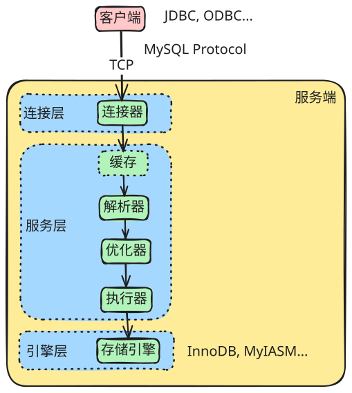

# MySQL 基础

## 服务端架构



MySQL 服务端架构主要分为三层，每一层承担不同的核心职责。SQL 的执行顺序按这个执行。

## 连接层

客户端连接层(Connectors & Connection Pool)负责处理客户端连接、权限认证、线程管理. 屏蔽客户端语言差异, 提供统一的通信协议(TCP/IP, Unix Sockets, Named Pipes 等), 管理并发连接.

关键组件/功能:

- ​​连接池(Connection Pool)​: 管理、复用客户端连接, 避免频繁创建销毁连接的开销.
- ​​身份验证(Authentication): 验证连接用户身份、密码、主机 IP 等权限.
- ​​安全管理(Security): 进行 SSL 加密等连接安全设置.
- ​线程管理(Thread Handling): 为每个客户端连接分配(或复用)一个服务线程, 处理后续请求.

::: tip
如何查看客户端连接?

```sh
mysql> SHOW PROCESSLIST;
+----+-----------------+------------------+------+---------+------+------------------------+------------------+
| Id | User            | Host             | db   | Command | Time | State                  | Info             |
+----+-----------------+------------------+------+---------+------+------------------------+------------------+
|  5 | event_scheduler | localhost        | NULL | Daemon  |  103 | Waiting on empty queue | NULL             |
|  8 | root            | 172.17.0.1:46336 | NULL | Sleep   |   47 |                        | NULL             |
|  9 | root            | 172.17.0.1:33334 | NULL | Query   |    0 | init                   | SHOW PROCESSLIST |
+----+-----------------+------------------+------+---------+------+------------------------+------------------+
3 rows in set (0.00 sec)
```
:::

::: tip
如何查看空闲连接(上述 Command 为 `Sleep` 的连接)的最大空闲时长?

```sh
mysql> SHOW VARIABLES LIKE 'wait_timeout';
+---------------+-------+
| Variable_name | Value |
+---------------+-------+
| wait_timeout  | 28800 |
+---------------+-------+
1 row in set (0.01 sec)
```
:::

::: tip
如何主动关闭空闲连接(上述 Id = 8 的连接)?

```sh
mysql> KILL CONNECTION 8;
Query OK, 0 rows affected (0.00 sec)

mysql> SHOW PROCESSLIST;
+----+-----------------+------------------+------+---------+------+------------------------+------------------+
| Id | User            | Host             | db   | Command | Time | State                  | Info             |
+----+-----------------+------------------+------+---------+------+------------------------+------------------+
|  5 | event_scheduler | localhost        | NULL | Daemon  |  660 | Waiting on empty queue | NULL             |
|  9 | root            | 172.17.0.1:33334 | NULL | Query   |    0 | init                   | SHOW PROCESSLIST |
+----+-----------------+------------------+------+---------+------+------------------------+------------------+
2 rows in set (0.00 sec)
```
:::

## 服务层

​服务层(Server Layer, 核心服务层 SQL Layer)负责解析 SQL 语句、执行优化、调用存储引擎接口、返回结果. 这是 MySQL 的大脑. 将用户请求的 SQL 语句转换成底层高效的操作指令.

关键组件/功能​​:

- ​​SQL 接口(SQL Interface): 接收客户端 SQL 请求并返回结果.
- 解析器(Parser): 对 SQL 语句进行​​词法分析​​和​​语法分析, 构建语法树. 检查语法错误.
- 查询优化器(Optimizer): **核心中的核心**. 根据解析树、统计信息、索引情况, **​​优化执行计划**(决定使用哪个索引、表的连接顺序、是否物化子查询等), 生成一个执行效率(时间成本、I/O 成本)预估最低的执行计划(Execution Plan). (查询缓存 (Query Cache) - MySQL 8.0 前存在: 若匹配, 直接返回缓存结果. 但因管理开销过大、适配性差, 在 8.0 已被移除).
- 执行器(Executor): **核心执行模块**. **调用​存储引擎 API 接口, ​​执行优化器生成的计划**. 它负责与存储引擎层交互, 读取数据、应用过滤条件、执行连接、排序、分组等操作.
- 内置函数(Built-in Functions): 执行日期、数学、加密等内置函数.

## 引擎层

存储引擎层(Pluggable Storage Engine Layer)负责​数据的物理存储格式、数据文件结构、索引类型、事务实现(ACID 特性)、锁粒度、缓存机制、崩溃恢复等. MySQL 的显著特点是采用可插拔的存储引擎架构. 实现数据持久化, 不同的引擎提供了数据存储管理、事务控制、并发机制的不同实现方案.

​​关键概念/引擎​​:

- 插件式设计(Pluggable): 用户可以为不同的表选择不同的存储引擎以满足特定需求(OLTP、OLAP、特殊场景).
- ​​主流引擎​​:
    - **InnoDB(MySQL 5.5 默认): 事务安全, 支持行级锁、外键、MVCC、崩溃恢复(ACID 特性), 基于聚簇索引组织数据.**
    - MyISAM(MySQL 5.5 前默认): 不支持事务和行级锁(表级锁), 性能较简单, 崩溃恢复能力弱. 已被弃用, 不推荐用于新项目.
    - Memory/Heap: 所有数据存放在内存中, 速度快, 但服务重启数据丢失, 表级锁. 用于临时表、缓存表.
    - Archive: 仅支持 INSERT 和 SELECT, 压缩率高, 适合存储归档数据.
    - CSV: 数据以 CSV 文件格式存储.
- 文件系统交互: 负责将数据、索引实际写入/读取磁盘文件.
