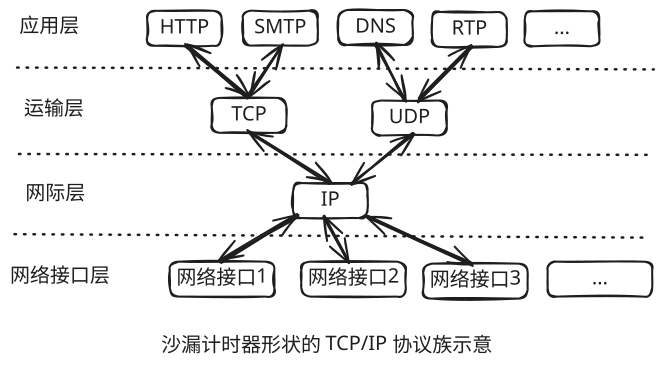

# 网络基础

## 计算机网络体系结构

<table>
    <thead>
        <tr>
            <th>OSI 七层模型</th>
            <th>TCP/IP 概念层模型</th>
            <th>功能</th>
            <th>协议族</th>
        </tr>
    </thead>
    <tbody>
        <tr>
            <td>应用层</td>
            <td rowspan="3">应用层</td>
            <td>文件传输，电子邮件，虚拟终端等</td>
            <td>TFTP, HTTP, FTP, SMTP, DNS, Telnet</td>
        </tr>
        <tr>
            <td>表示层</td>
            <!-- <td></td> -->
            <td>数据格式化，代码转换，数据加密</td>
            <td>无</td>
        </tr>
        <tr>
            <td>会话层</td>
            <!-- <td></td> -->
            <td>建立或解除与别的接点的联系</td>
            <td>无</td>
        </tr>
        <tr>
            <td>传输层</td>
            <td>传输层</td>
            <td>提供端对端的接口</td>
            <td>TCP, UDP</td>
        </tr>
        <tr>
            <td>网络层</td>
            <td>网络层</td>
            <td>为数据包选择路由</td>
            <td>IP, ICMP, RIP, OSPF, BGP, IGMP</td>
        </tr>
        <tr>
            <td>数据链路层</td>
            <td rowspan="2">网络接口层</td>
            <td>传输有地址的帧及其错误检测功能</td>
            <td>SLIP, CSLIP, PPP, ARP, RARP, MTU</td>
        </tr>
        <tr>
            <td>物理层</td>
            <!-- <td></td> -->
            <td>以二进制数据形式在物理媒介上传输数据</td>
            <td>ISO2110, IEEE802, IEEE802.2</td>
        </tr>
    </tbody>
</table>

TCP/IP 协议族是一种沙漏形状，中间小两边大，**IP 协议**在其中占据举足轻重的低位。

